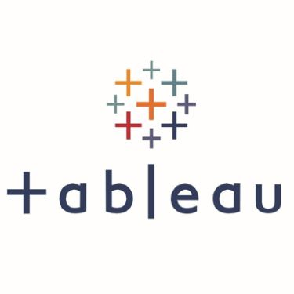

### Hi there, I'm Abhinandan (Abhi)  

Welcome to my profile. Glad to see you here.  I'm a passionate learner who's always willing to learn and work across technologies and domains 💡. I love to explore new technologies and leverage them to solve real-life problems ✨. I'm currently into Business Analytics 🕸️ and Data Science 👀.

### More about me:
- 🔭 I’m currently working on various analytics projects 

- 👯 I’m looking to collaborate on : new ideas to fine tune my analytics skills

- 🤔 I’m always looking for more intersting articles about business analytics and product management

- 💪🏼 Future Goals: Learn more technologies - Never stop creating new ideas.

- 💬 Ask me about : Data Analytics projects, business intelligence use cases, embedded systems, bio-engineering

- 📫 You can reach me on <a href="https://www.linkedin.com/in/abhinandanaggarwal/" rel="nofollow">Linkedin</a>  for complete background and contact.

- 😄 Pronouns: He/Him

- ⚡ Fun fact: I've never seen snow in my life.

- 😎 You might find me pretending to work in a cafe.

### Let's Connect :coffee: 

	
	
	

   

 

 

 

<!-- 
 -->

	

<h2><b>💻 Tech Stack</b></h2>

 

 

		     

 

<a href="https://matplotlib.org/3.3.3/contents.html" target="_blank"> &nbsp;</a> 

	
	
	
	

### Spotify Playing 🎧

